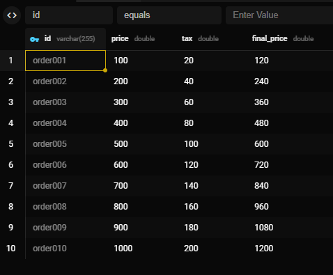

# Challenge: Clean Architecture

## How to run the project

### Prerequisites: docker-compose and migrations
* In the root directory, run `docker-compose up -d`
* When you run the `main.go` file, the migrations will be executed automatically
* Will be created a new table called `orders` with the following fields:
    * `id` - varchar(255)
    * `price` - double
    * `tax` - double
    * `final_price` - double
* Also, will be created sample data to test the application
* The sample data is the following:



## Run the project
* Go to `cmd/ordersystem` directory 
* Run `go run main.go wire_gen.go`

### Via REST API
#### Create a new order via `api.http` file
* Open `api.http` file
* Click on `POST .../order` and then click on `Send Request`
* Alternate on `id`, `price` and `tax` fields to create a new order

#### Get all orders via `api.http` file
* Open `api.http` file
* Click on `GET .../order` and then click on `Send Request`

### Via GRPC
* On the terminal run `evans -r repl` to access the GRPC client
#### Create a new order
* Run `call CreateOrder` to create a new order
* Enter the `id`, `price` and `tax` fields to create a new order
#### List all orders
* Run `call ListOrders` to get all orders

### Via GraphQL
* Open `http://localhost:8080/` on the browser
#### Create a new order
* Run the following mutation to create a new order
```graphql
mutation createOrder {
    createOrder(input: {id: "abc123", Price: 10.0, Tax: 2.0}) {
        id
        Price
        Tax
        FinalPrice
    }
}
```

#### List all orders
* Run the following query to get all orders
```graphql
query listOrders {
    listOrders {
        id
        Price
        FinalPrice
    }
}
```